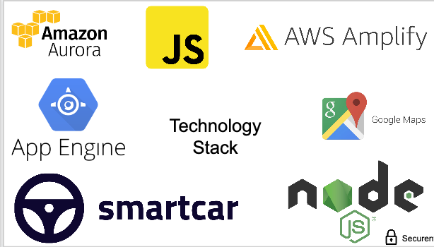
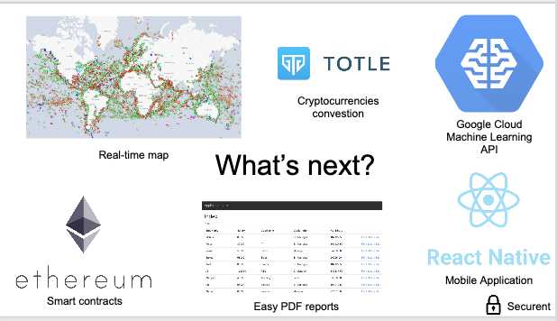

## [Project website](https://artem-tkachuk.github.io/Securent/)

## Philosophy
More than **26%** of all fatal car accidents happen because of the drivers exceeding the speed limit. 

This number concerns us a lot and we want to significantly reduce it. 

We sincerely believe our product will make the roads safer, reduce the number of accidents and make the world a better place! If people will be driven by savings, they will volunteer to obey speed limits to make car rentals more profitable for them!

## Inspiration
Each of us uses car rentals a lot. We also know people who allow others to rent their cars. Being informed about some of the _problems_ with this process, we decided to design a product, that will both 
1. motivate drivers to <i>obey</i> speed limits by giving growing rent discounts to good-doing drivers
2. let car owners make **confident and reasonable** decisions about trusting / not trusting the potential car renter   

## What it does
We allow our users to either rent a car or post the car for rent on the list of all available cars. 

When the user wants to _rent_ a car, he picks one from the list and the request is sent to the owner. The owner of the car _review_ the profile of potential renter (especially his **rating** based on previous history) and decide whether he allows or denies the request. 

When allowed, the renter can [lock](https://smartcar.com/docs/api#post-security) / [unlock](https://smartcar.com/docs/api#post-security) the car. When the trip begins, we start tracking the speed of the car by frequently querying it for the change of location and calculating the speed. Having this, we instantly call Google Maps API for getting the [speed limit](https://developers.google.com/maps/documentation/roads/speed-limits) for car's [current location](https://smartcar.com/docs/api#get-location). We compare them and make records on how the driver is doing. After the trip we change the overall rating of the renter. 

If the user wants to _make_ his car _available_ for renting, he goes through [Smartcar's OAuth](https://smartcar.com/docs/api#introduction) process and allow the application to access specific permission.

## How we built it
For building the MVP of the product, we started with learning [AWS Amplify](https://aws-amplify.github.io/), doing sign in / sign up form and creating [React application](https://aws-amplify.github.io/docs/js/start?ref=amplify-rn-btn&platform=react-native). We also created [AWS Aurora](https://aws.amazon.com/ru/rds/aurora/) database. And a [website](https://artem-tkachuk.github.io/Securent/)!

We wrote a local [Node.js server](https://cloud.google.com/nodejs/getting-started/hello-world) where we used [Smartcar API](https://smartcar.com/docs/api#introduction). We deployed this server on [Google Cloud App Engine](https://cloud.google.com/appengine/docs/standard/nodejs/building-app/deploying-web-service) and made it talk with the AWS Aurora database mentioned above. 

Our amazing future plans include Totle, Etherium and Google Cloud Machine Learning APIs. 

## Challenges we ran into
1. AWS Aurora permissions restriction to access the database from Google Cloud App engine Node.js deployed server. It took a big while to figure it out!
2. Retrieving data from our designed AWS Aurora database API to display it as a table
3. Port issue with deploying on Google Cloud platform
4. refreshing the Smartcar access token
5. Parsing API response from a database and rendering it as a table in React App
6. ...
7. ...  
another million of minor challenges that we ran into and solved

## Accomplishments that we are proud of
1. We managed to set up an Amplify React application
2. We were able to established a working connection between each other
3. We successfully went through a JavaScript callback hell!
4. We made GCP and AWS work together!
5. We reduced the number of fatal car accidents
6. We made roads safer
7. We helped people save money
8. We allowed car owners to make confident choice in giving / not giving permissions

## What did we learn throughout these days?
This hackathon was an amazing experience for us. These are some of the many things we learned:

0. How to work _as a team_
1. How to create web apps using React framework
2. What is [AWS Amplify](https://aws-amplify.github.io/) and how to do authorization form as well as React apps using it
3. How to deploy Node.js on Google Cloud
4. How to use Google Maps speed limits API given latitude and longitude
5. How to use smartcar API
6. How to stack cups
8. So much more

## How do we develop it further and make it an <i>truly amazing</i> application?

We are _absolutely_ motivated to improve our application and inspired by the idea! Here are some things we are already working today:
1. Adding reports (easy-printable PDF documents) of user's driving history with an overall rating ==> user can show it to insurance company when buying a new car and car owners can better understand his style of driving for allowing _future_ rentals
2. Involving [Ethereum's](https://www.ethereum.org/) smart contracts that execute at a specific number of miles travelled. If a user is a good driver (based on his history) and he continues driving after the smart contract is executed, he is chared less than a bad driver. But the record about this excess still appears on the report
3. Using [Google Cloud Machine learning APIs](https://cloud.google.com/ml-engine/) to recognize user by comparing his photo and profile picture to avoid malacious hackers
4. Showing a real-time **map** with pinned locations of all cars available (not being rented at that moment) in the database ==> information is _visualized_
5. Adding multi-cryptocurrency payments using [Totle](https://www.totle.com/) API. Because paying in various cryptos _should not_ be a problem for renting a car and should also be smooth and easy
6. Showing the user the **closest** cars first ==> easier to choose because the user does not want to go to another part of the city to rent a car
7. Modifying the existing system of discounts to record the number of times user exceeded the speed limit and the magnitude of this access
8. Optimizing tracking while driving to use less resources on the cloud
9. Implement React Native mobile application (the easiest step since React code is converted to React Native code with a minimal effort)
9. ...   
10. ...   

We will continue working on this project **as a team**. 

We belive perfecting it will make the world we live in today a much _better_ place!